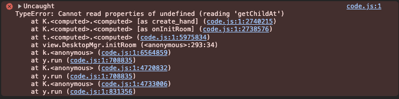
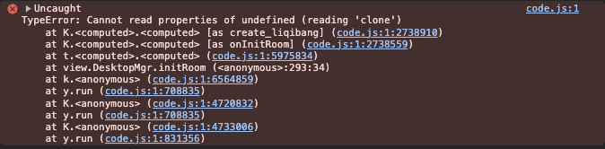

# 注意事项

## 自制回放对所查看牌谱的要求

在 [README](README.md) 中提到查看的谱不是随便的, 下面简单从文件的角度说一下原理:

当我们查看牌谱时, 无论是否使用 main.js 进行了修改, 雀魂网页只会向后端请求下载所点击查看的牌谱的以下数据:

- 真实的牌谱对局数据
- 真实的玩家数据(角色, 段位等级, 装扮等)
- 真实的资源文件(部分与真实的玩家数据对应, 如立绘png文件与玩家使用的角色对应)

实际查看牌谱时, 我们会看到以下数据:

- 显示的牌谱对局数据
- 显示的玩家数据
- 显示的资源文件

通过 main.js 进行的修改, 我们可以把显示的牌谱对局改成我们自制的, 而不是真实下载的(重定向)

显示的玩家数据也可以修改, 但是限制就有了, 因为**已有的资源文件**只有"真实的资源文件", 所以, 当超过这个资源范围时, 可能就会出现问题

- 如果这个资源在加载牌谱时不是必要的(可以在进入回放后下载, 比如角色的头像, 立绘), 那么这种数据就可以修改, 但是下载和加载都需要时间, **所以第一次回放时会比较卡**
- 但如果这个资源在加载牌谱时是必要的(或者有资源检查, **比如手的样式和立直棒**), 那么这种数据只能在真实牌谱资源的范围内进行修改, 超过这个范围就会报错,

没能加载手的样式导致的报错: 

没能加载立直棒导致的报错: 

所以, 对应的要求就是: 

1. 自制的立直麻将对局最好不要查看赤羽之战的谱, 因为赤羽之战的相关资源太少, 缺少立直棒, 字牌和赤宝牌
2. **自制牌谱中用到了什么手的样式和立直棒, 那真实牌谱中一定也要有**

**报错方面, 最终结论就是上面两种情况: 如果是角色信息导致的报错, 基本是 "slot": 0 (立直棒)和 "slot": 3 (手的样式) 资源没加载出来导致的**

- 一种比较典型的情况是没有特意修改立直棒的样式, 却仍然有没能加载立直棒的报错, 这种情况是真实牌谱中的所有玩家**没有一个使用默认立直棒**
- 另一种情况是真实对局含有这个角色, 却有没能加载手的样式的报错, 这种情况是那个玩家的**手的样式不是角色自己的**, 需要确认一下手的样式

## 角色的分类

在选取角色 avatar_id 时, 需要注意以下部分

**目前角色分成 使用一般手模的女角色 和 其他角色, 其他角色因为实现方式的不同所以回放js文件稍有差别,
最直观的感受就是回放products的output文件夹下的 其他角色 的牌谱时, 会输完脚本会直接跳转到查看牌谱**

**其他角色包括: 所有男角色, 女角色中狂赌之渊联动除了生志摩妄的三个, 藤本绮罗, 莎拉, 伊莉雅联动的小黑 和 汉娜**

**目前其他角色的两种实现方式如下:**

- 选择牌谱进行查看时, 查看有对应角色的真实牌谱, 比如自制牌谱中有赤木茂, 那就查看真实牌谱中含有斗牌联动两个人中的任意一个的
  (注意真实牌谱中也要有玩家带有默认立直棒这种东西, 否则也会报错, 或者改成牌谱中有的装扮)
    - 优点: 能完美体现角色特征
    - 缺点: 比较蠢, 有点麻烦, 而且真实牌谱中的这个角色还得用的是原来的手样式, 否则加载不出来资源, 再而且如果自制牌谱中含有不止一种其他角色的,
      找真实牌谱会有点困难
      (目前真实牌谱已经结合到自制牌谱的js文件中, 已解决大部分缺点, 不用手动找对应牌谱放映, 这里要感谢雀魂bot"姬萌萌"的作者 [Paulzzh](https://space.bilibili.com/73796753))
- 把其他角色的手的样式改成和用普通手的女角色一样,
    - 优点: 改动比较简单
    - 缺点: 不能完美的体现角色的特征, 某些角色使用女普通手可能会有点怪

在 [products](../products) 文件夹下面的 python 脚本中, 使用的是第一种方法, 而且我把含有该角色的牌谱也放到了字典里面, 供查阅和使用

若自制牌谱中使用了不止一种非普通手样式的, 比如伊莉雅联动的四个角色一桌, 同时需要 女深色手(小黑) 和 男性手(吉尔), 
有关系的话可以联系能爬取牌谱屋数据的玩家, 比如雀魂吧小吧主[甜甜cbstt](https://space.bilibili.com/437346309)

也可以自己在牌谱屋找, 会有点麻烦, 可以按照以下思路:

- 先到牌谱屋查四麻金之间打的比较多的玩家(三麻不行因为天生少一人, 找起来更慢. 那为什么是金之间呢, 因为越高段位场玩家不使用默认立直棒的概率越高, 这样仍不能满足需求)
- 逐个查看牌谱, 直到查找其中一种(比如使用女深色手的角色), 记住一定要放一下角色的切牌动作看看用的是不是默认手, 因为可能会用其他手的样式, 这样也没用
- 查找到之后, 再到牌谱屋转到使用这个角色的玩家的界面("时间局部性原理": 玩家某时刻使用了这个角色, 则在这个时间前后也有比较高的概率继续使用该角色)
- 在这个玩家的界面查找到上面的那个牌谱, 然后在这牌谱的时间前后查找另一个手
- 如此往复, 如果最终得到的结果仍不满足条件, 那就再次迭代查找
