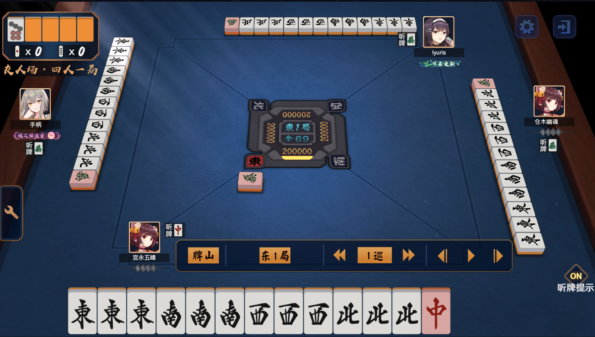

# 十八倍铳满_一个真实存在的测试对局

牌谱UUID: `200610-50aa82d2-577d-4ac3-b0d9-838f1a1d9ac3`

视频: [【雀魂·十八倍铳满】已经被修复的BUG，一瞬间的六倍役满](https://www.bilibili.com/video/BV1s54y1Q75z)

据UP及其他参与者描述: 这是猫粮的测试接口对应的对局, 现已修复

官方的测试牌型里只有四种, 
第一种无限天和十三面其余家也是一模一样分牌, 
第二种是2345678m2345678s, 打258m即可天铳三家, 
第三种是视频里的这种, 
第四种是南家起手1111s7s东东东东中中中中, 然后其余家国士听中, 东家没人和, 其余两家人和国士

注意: 真实牌谱中是没有报菜名语音的, 视频中应该使用了解锁报菜名插件有报番语音

我这里为了存档防止猫粮封杀不让查看这个牌谱, 我下载了这个真实对局的牌谱信息 [json 文件](paipu_200610-50aa82d2-577d-4ac3-b0d9-838f1a1d9ac3.json), 并自制了这个对局, 文件存为 [paipu.js](paipu.js)

事实上有被封杀的牌谱的例子, 比如这个 `230927-6c344aaf-1a63-477c-b14c-c2a0a7f39db8`, 这个是当时大小三元未计算的bug, 查看会显示系统错误

真实牌谱截图:

