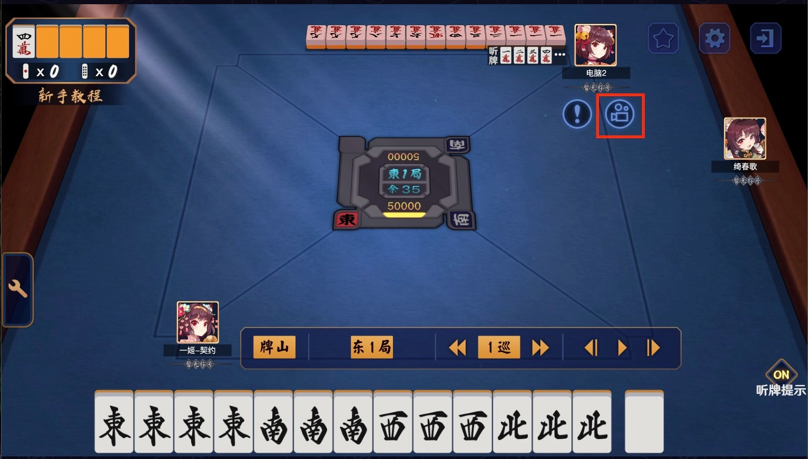

# 二人麻将

二人麻将与三人麻将类似, 二人麻将不使用2-8饼和2-8索, 西风和北风都可以当做"拔西宝牌"和"拔北宝牌" (统称"拔北")

(在 `leimingpai` 函数中, 若拔北没有牌对应的参数, 则优先"拔北", 然后"拔西")

此外, 玩家起始点数50000

## 注意事项

- `mode` 需要改成不低于"20"的数字, 建议为21
- 因为雀魂中没有二人麻将对应的 `mode`, 这里为了左上角房间信息美观, 将 `category` 改成了 100, 即"新手教程"模式
- 受限于 add_function.js 的实现逻辑, 首次进入回放时玩家会显示异常(多一家), 此时切换一下"对家"的视角即可(注意不要切到"
  下家", 否则控制台会报错卡住)

另外记得导入 [add_function.js](../../../add_function.js)

## 示例牌谱

- [demo01](demo01.js)
